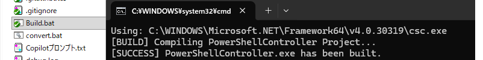
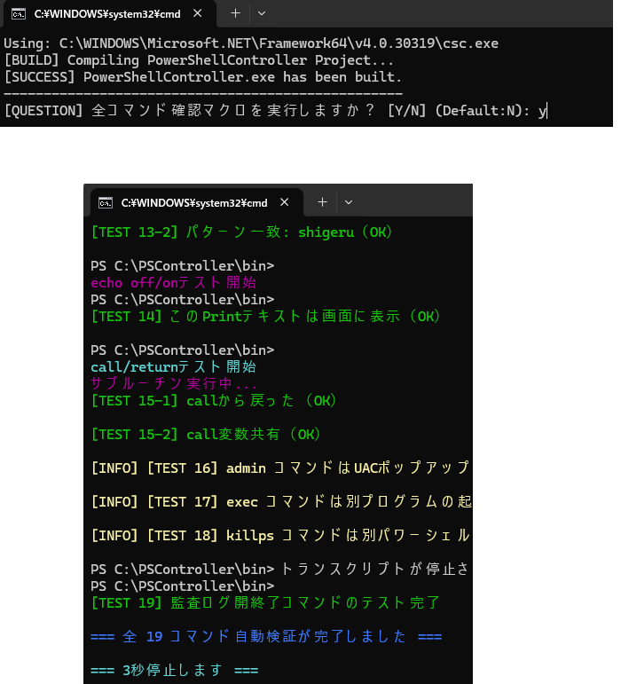
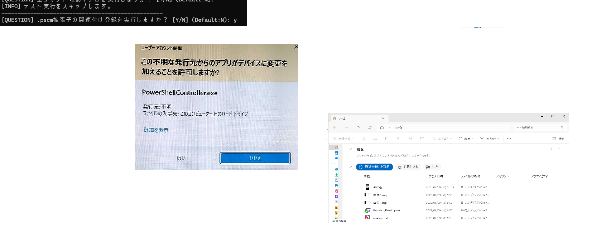
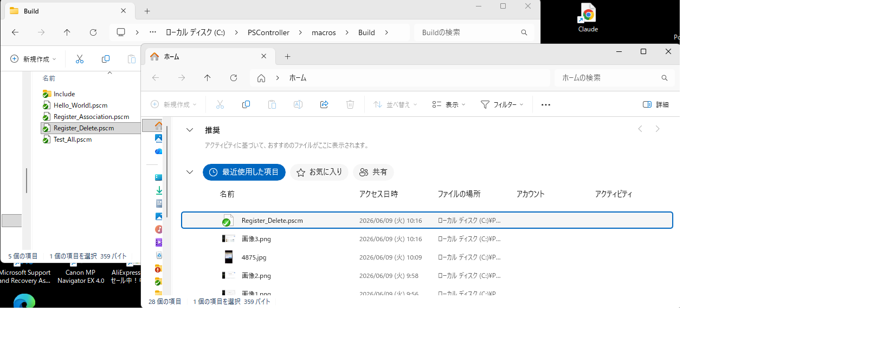

## Build詳細リファレンス

### Build

---

#### Buildの実行

ローカルにダウンロードしたフォルダ上にある、Build.batをダブルクリックで実行します

①Windowsディレクトリを取得し、中にある　C＃コンパイラを探します
②bin、logフォルダを作成します
③version設定の為.git,日付を取得します
④コンパイルを行います

**注意事項：**
- C#コンパイラは64Bit版を探し、なければ32Bit版を探しに行きます
- versionにGit が無い場合は NO_GIを設定します

#### TESTの実行

ビルドが完了すると、画面上に

[QUESTION] 全コマンド確認マクロを実行しますか？ [Y/N] (Default:N):

確認マクロの実行を訪ねる[QUESTION]が出ます。
正しくビルドが行われたかを確認するため、y + Enterを入力してください。

ビルド確認用のTESTマクロが実行します。

**注意事項：**
- ビルドに問題がある場合、画面上に赤い文字でERR通知されます。
- 

#### .pscm拡張子の関連付け登録の実行

TESTが完了すると、画面上に

[QUESTION] .pscm拡張子の関連付け登録を実行しますか？ [Y/N] (Default:N):

関連付け登録の実行を訪ねる[QUESTION]が出ます。

PSControrerをマクロファイルと関連付けるため、y + Enterを入力してください。

関連付け登録用のマクロが実行します。

**注意事項：**
- Registerに登録するため管理者権限に移行するためのポップアップが出ます
- 関連付けを削除するためのRegister_Delete.pscmが\macros\Buildにあります。

#### アンインストール

PSControrerプログラムと機能に登録は登録されません。

PSControrerフォルダごと削除してください。

**注意事項：**
- 関連付けを設定した場合は、\macros\Build\Register_Delete.pscを実行したあと、削除してください。

