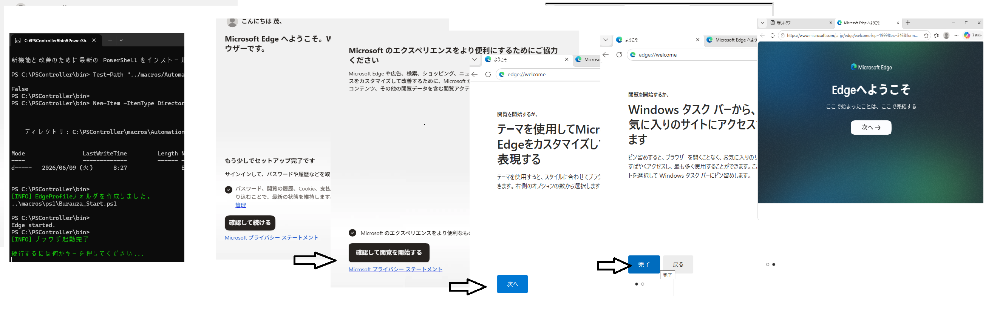
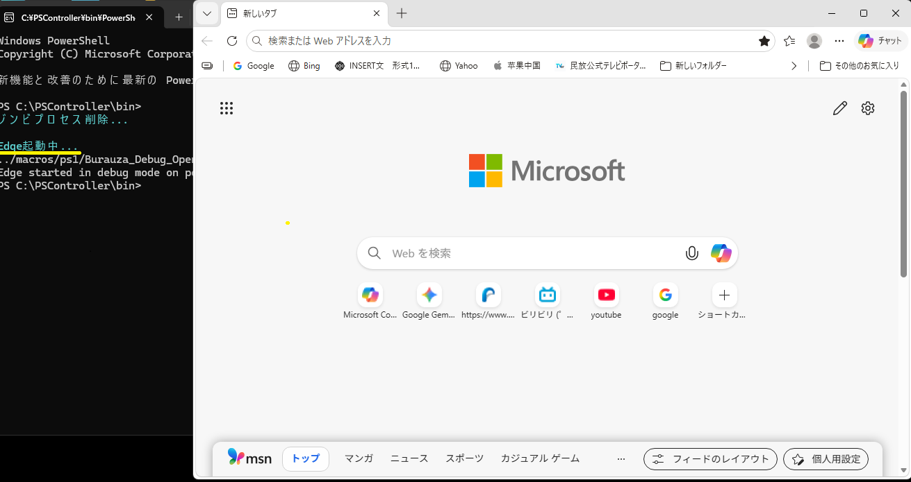
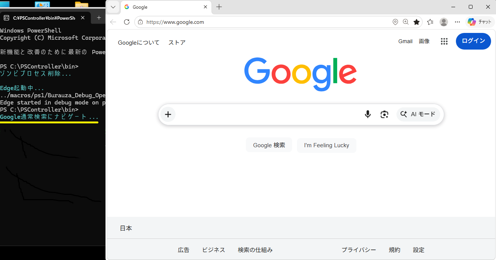
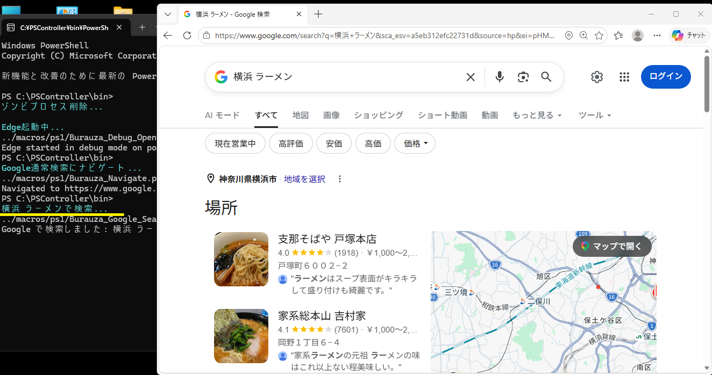
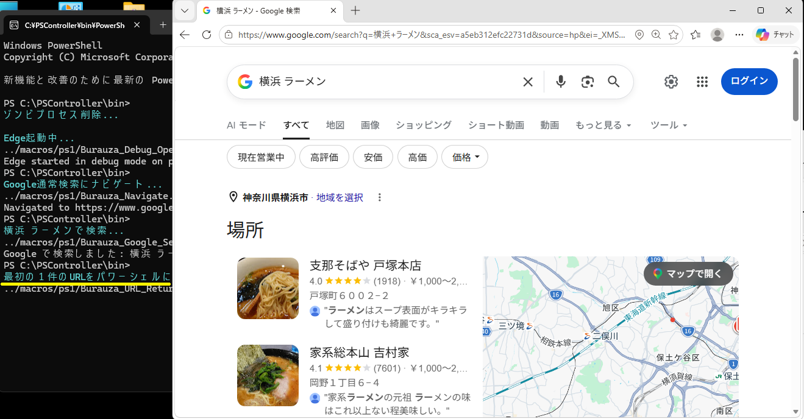
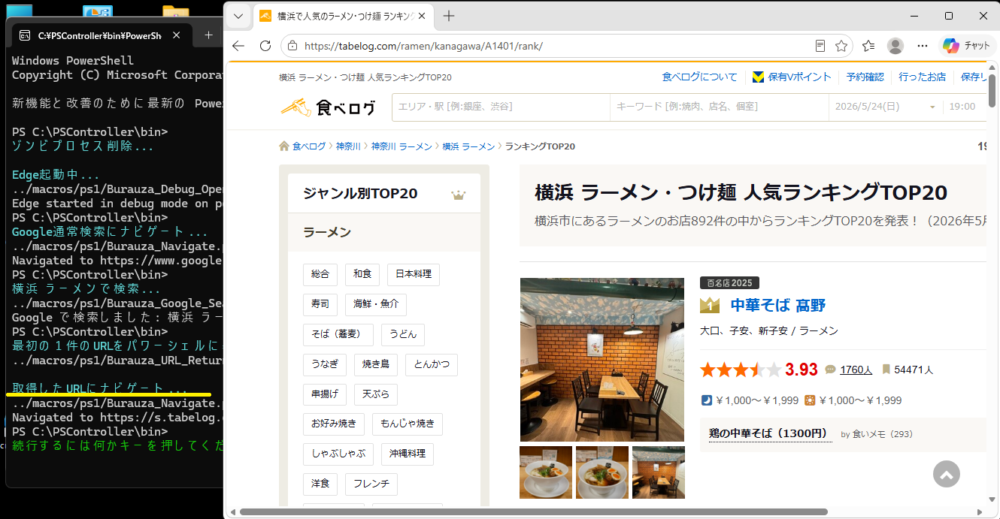

# サンプルマクロ紹介

## 準備：プロファイルの作成

**マクロファイル：** `macros\Automation\Burauza_Start.pscm.pscm`

\macros\AutomationにEdgeProfileというプロファイル用フォルダを作成しEdgeを立ち上げます。

Burauza_AutomaticSearch.pscm用のプロファイルです。

初期ブラウザ立ち上げの設定画面が動きます。デフォルトで設定し終了させてください。

### マクロ全体

```text
wait >
echo on
;killps

; EdgeProfileフォルダの存在チェック
sendln Test-Path "../macros/Automation/EdgeProfile"
getvar ret
sendln
if "%ret%" == "False"
	wait >
    sendln New-Item -ItemType Directory -Path "../macros/Automation/EdgeProfile" -Force
    wait >
    print green [INFO] EdgeProfileフォルダを作成しました。
else
	wait >
    sendln Remove-Item -Path "../macros/Automation/EdgeProfile/*" -Recurse -Force
    wait >
    print yellow [INFO] EdgeProfileフォルダの中身を削除しました。
endif
; ブラウザ起動
sendln ..\macros\ps1\Burauza_Start.ps1
wait >
print green [INFO] ブラウザ起動完了
pause
exit
```



## その1：自動検索

**マクロファイル：** `macros\自動実行\自動検索.pscm`

Edgeをデバッグモードで起動し、Googleで「横浜 ラーメン」を検索して、最初の検索結果のURLにナビゲートするまでを完全自動化するサンプルです。

---

### マクロ全体

```text
echo on
wait >
print cyan ゾンビプロセス削除...
Killps
print cyan Edge起動中...
../macros/ps1/Burauza_Debug_Open.ps1
wait >
setvar URL https://www.google.com/
print cyan Google通常検索にナビゲート...
../macros/ps1/Burauza_Navigate.ps1 %URL%
wait >
print cyan 横浜 ラーメンで検索...
../macros/ps1/Burauza_Google_Search.ps1 "横浜 ラーメン"
wait >
print cyan 最初の１件のURLをパワーシェルに表示...
../macros/ps1/Burauza_URL_Return.ps1
getvar URL
print cyan 取得したURLにナビゲート...
../macros/ps1/Burauza_Navigate.ps1 %URL%
wait >
pause
exit
```

---

### 実行ステップ

#### STEP 1：Edgeを起動

既存のEdgeプロセスを終了し、リモートデバッグポート9222でEdgeをデバッグモード起動します。


### 実行時の注意
> [!NOTE]
> **初めてEdgeを起動する場合の注意**
> PC上で初めてMicrosoft Edgeを起動すると、初回セットアップ（アカウントログインの推奨など）が表示されます。自動操作が正常に完了するよう、あらかじめ手動でセットアップを済ませ、Edgeが通常通り利用できる状態にしてから本マクロを実行してください。

```text
print cyan Edge起動中...
../macros/ps1/Burauza_Debug_Open.ps1
wait >
```



---

#### STEP 2：Googleにナビゲート

変数 `URL` に `https://www.google.com/` をセットし、Edgeをナビゲートします。ページの読み込み完了を確認してから次のステップへ進みます。

```text
setvar URL https://www.google.com/
print cyan Google通常検索にナビゲート...
../macros/ps1/Burauza_Navigate.ps1 %URL%
wait >
```



---

#### STEP 3：「横浜 ラーメン」で検索

Googleの検索ボックスに「横浜 ラーメン」を入力し、Enterキーを送信して検索を実行します。検索結果ページの読み込み完了を確認してから次のステップへ進みます。

```text
print cyan 横浜 ラーメンで検索...
../macros/ps1/Burauza_Google_Search.ps1 "横浜 ラーメン"
wait >
```



---

#### STEP 4：最初の1件のURLを取得

検索結果ページのDOMを解析し、最初の外部リンクURLを取得して変数 `URL` に格納します。

```text
print cyan 最初の１件のURLをパワーシェルに表示...
../macros/ps1/Burauza_URL_Return.ps1
getvar URL
```

> **注意：** このステップの直前に `pause` を入れてはいけません。Googleは検索結果表示後もDOMを動的に書き換え続けるため、時間を置くとURLが取得できなくなります。



---

#### STEP 5：取得したURLにナビゲート

STEP4で取得したURLにEdgeをナビゲートします。ページの読み込み完了を確認してから終了します。

```text
print cyan 取得したURLにナビゲート...
../macros/ps1/Burauza_Navigate.ps1 %URL%
wait >
pause
exit
```



---

### 使用するps1スクリプト

| ファイル | 役割 |
|---|---|
| `macros\ps1\Burauza_Debug_Open.ps1` | Edgeをデバッグモードで起動 |
| `macros\ps1\Burauza_Navigate.ps1` | 指定URLにナビゲート（読み込み完了まで待機） |
| `macros\ps1\Burauza_Google_Search.ps1` | 検索ボックスにキーワードを入力して検索実行 |
| `macros\ps1\Burauza_URL_Return.ps1` | 検索結果ページの最初の外部リンクURLを取得 |
