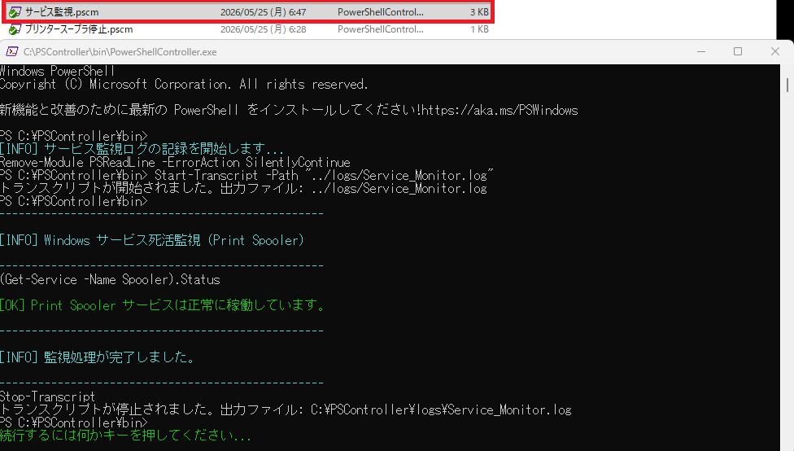
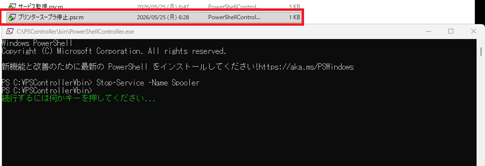
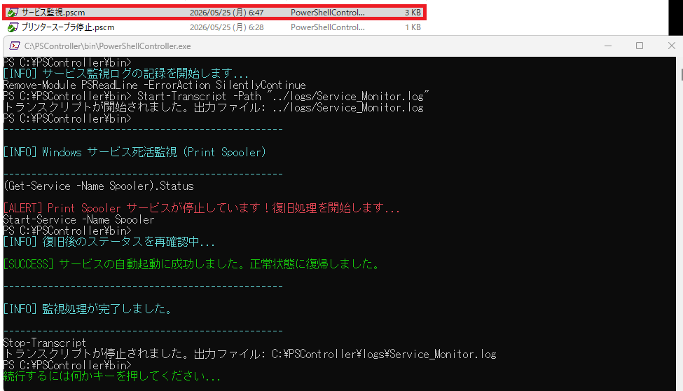

# サンプルマクロ紹介

## その2：Windowsサービスの死活監視と自動復旧マクロ

### 📁 マクロファイル構成
* **本編（監視・復旧）：** `macros\自動実行\サービス監視.pscm`
* **検証用（サービス停止）：** `macros\自動実行\プリンタースープラ停止.pscm`

### 📝 概要
本サンプルマクロ（`サービス監視.pscm`）は、企業のシステム運用やインフラ保守において最も頻出する**「特定のWindowsサービス（例：印刷管理サービス Spooler）の死活監視と、停止時の自動復旧処理」**を行う実務直結の自動化スクリプトです。

PSControllerの強みである**「管理者権限への自動昇格」」「対話的な条件分岐」「実行ログの自動保存（エビデンス確保）」**をフルに活用しています。

---

### 💻 マクロコード全体 (`サービス監視.pscm`)

```text
; Admin,Echoはwait >の前でも問題ない。
admin
echo on
; 【対策】パワーシェル開始メッセージなどの余計な出力をここで一旦やり過ごす
wait >

; --- ログ記録の開始 ---
print cyan [INFO] サービス監視ログの記録を開始します...
.logopen ../logs/Service_Monitor.log

; 【対策】Transcript開始メッセージなどの余計な出力をここで一旦やり過ごす
wait >

print cyan --------------------------------------------------
print cyan [INFO] Windows サービス死活監視 (Print Spooler)
print cyan --------------------------------------------------

; 変数領域をあらかじめ確保（初期化）
setvar SERVICE_STATUS ""

; 状態確認用のPowerShellコマンド
(Get-Service -Name Spooler).Status

; 直前の出力を即座に変数へ取得
getvar SERVICE_STATUS

; --- 条件分岐（死活監視） ---
if "%SERVICE_STATUS%" == "Running"
    print green [OK] Print Spooler サービスは正常に稼働しています。
    goto END_PROCESS
endif

if "%SERVICE_STATUS%" == "Stopped"
    print red [ALERT] Print Spooler サービスが停止しています！復旧処理を開始します...
    
    ; サービス起動コマンドを送信
    Start-Service -Name Spooler
    wait >
    
    ; 復旧確認のために3秒待機してから再チェック
    pause 3
    
    print cyan [INFO] 復旧後のステータスを再確認中...
    
    ; 復旧確認用の変数領域をあらかじめ確保
    setvar NEW_STATUS ""
    
    ; ステータス再取得コマンド
    (Get-Service -Name Spooler).Status
    
    ; 即座に取得
    getvar NEW_STATUS
    
    ; Unknownコマンドのあとsetvar,getvarがある場合、プロンプトをgetvarが使用するので、wait >は不要
    
    if "%NEW_STATUS%" == "Running"
        print green [SUCCESS] サービスの自動起動に成功しました。正常状態に復帰しました。
    else
        print red [ERROR] サービスの自動起動に失敗しました。手動での確認が必要です。
    endif
else
    ; 想定外のステータス（StoppingやStarting、または文字列混入時）の場合
    print yellow [WARNING] サービスが不安定な状態です（現在の状態: %SERVICE_STATUS%）。
endif

:END_PROCESS
print cyan --------------------------------------------------
print cyan [INFO] 監視処理が完了しました。
print cyan --------------------------------------------------

; --- ログ記録の終了と終了処理 ---
.logclose
; 【対策】Transcript終了メッセージなどの余計な出力をここで一旦やり過ごす
wait >

pause
exit
```

---

### 💡 技術的な注意事項

> [!NOTE]
> **管理者権限（Admin）の挙動について**
> サービスの監視（状態取得）自体には管理者権限は不要ですが、停止時の自動復旧（`Start-Service`）には権限が必要となるため、マクロの冒頭に `admin` コマンドを組み込んでいます。
> 
> * **対話実行時：** マクロ実行時にWindowsの昇格確認（UAC）ポップアップが表示されます。
> * **無人運用時：** 本番環境等でスケジュール実行する際は、呼び出し元となる `PowerShellController.exe` 自体に予め管理者権限を付与して起動させておけば、マクロ内の `admin` コマンドはスクリプト上で自動的にスキップ（無視）され、ポップアップを挟まずに完全自動実行が可能です。

---

### 🛠️ 実行ステップと動作検証

#### STEP 1：通常稼働状態での監視テスト
プリンタースプーラー（Spooler）サービスが正常に動いている状態で `サービス監視.pscm` を実行します。

* **動作結果：** マクロは即座に正常稼働を検知し、`[OK] Print Spooler サービスは正常に稼働しています。` と表示して安全に終了します。



---

#### STEP 2：【検証用】サービスを意図的に停止させる
テストを実施するため、以下の検証用マクロ（`プリンタースープラ停止.pscm`）を実行し、意図的にサービスを停止状態（`Stopped`）にします。

```text
echo on
admin
wait >
Stop-Service -Name Spooler
wait >
pause
exit
```



---

#### STEP 3：異常検知と自動復旧のテスト
サービスが停止している状態で、再度 `サービス監視.pscm` を実行します。

* **動作結果：** マクロがサービス停止を発見し、`[ALERT] Print Spooler サービスが停止しています！復旧処理を開始します...` をコンソールに表示後、自動的に再起動コマンドを安全に発行します。



---

#### STEP 4：実行ログ（エビデンス）の確認
処理が完了すると、`\PSController\logs\Service_Monitor.log` に自動的にログが記録されます。
PSControllerの内部マクロコマンドは混入せず、**PowerShellに送信された生のコマンドとネイティブな出力結果のみがピュアに保存**されます。

```text
**********************
Windows PowerShell トランスクリプト開始
開始時刻: 20260525073152
ユーザー名: WIN11-64\shigeru
RunAs ユーザー: WIN11-64\shigeru
構成名: 
コンピューター: WIN11-64 (Microsoft Windows NT 10.0.26200.0)
ホスト アプリケーション: powershell.exe -NoExit -ExecutionPolicy Bypass
プロセス ID: 5336
PSVersion: 5.1.26100.8457
PSEdition: Desktop
PSCompatibleVersions: 1.0, 2.0, 3.0, 4.0, 5.0, 5.1.26100.8457
BuildVersion: 10.0.26100.8457
CLRVersion: 4.0.30319.42000
WSManStackVersion: 3.0
PSRemotingProtocolVersion: 2.3
SerializationVersion: 1.1.0.1
**********************
トランスクリプトが開始されました。出力ファイル: ../logs/Service_Monitor.log
PS C:\PSController\bin> (Get-Service -Name Spooler).Status
Stopped
PS C:\PSController\bin> Start-Service -Name Spooler
PS C:\PSController\bin> (Get-Service -Name Spooler).Status
Running
PS C:\PSController\bin> Stop-Transcript
**********************
Windows PowerShell トランスクリプト終了
終了時刻: 20260525073155
**********************
```

---

### 🧩 使用する外部スクリプト（.ps1）
* **なし**（外部のスクリプトファイルを一切用意することなく、マクロ制御と標準PowerShellコマンドだけで完結する、極めてポータビリティの高い構造になっています）
