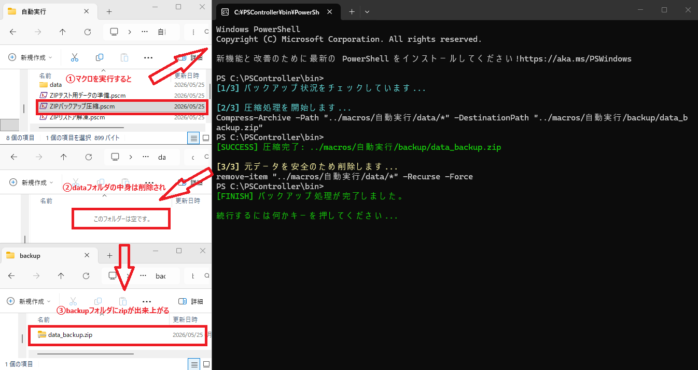

# サンプルマクロ紹介：自動化ツール・シリーズ

## その3：ZIP圧縮バックアップとリストアの自動化

### 📁 マクロファイル構成
日常の運用を支える、堅牢なデータ管理用マクロセットです。

* **セットアップ：** `macros\自動実行\ZIPテスト用データの準備.pscm`
* **メイン（バックアップ）：** `macros\自動実行\ZIPバックアップ圧縮.pscm`
* **メイン（リストア）：** `macros\自動実行\ZIPリストア解凍.pscm`

**作業用ディレクトリ：**
* `macros\自動実行\data\` （バックアップ対象データ格納）
* `macros\自動実行\backup\` （ZIPアーカイブ保存先）

---

### 📝 概要
運用の現場で必須となるデータ保全を完全自動化します。ZIPファイルの二重存在を検知して処理を安全に中断する「Fail-Safe」設計を採用し、誤操作によるデータ紛失や上書きミスを未然に防ぎます。

---

### 💻 マクロコード：テスト環境構築 (`ZIPテスト用データの準備.pscm`)

```text
admin
echo on
wait >

print cyan [INFO] テスト用データの準備を開始します...

; フォルダ確認と作成
sendln if (-not (Test-Path "../macros/自動実行/data")) { New-Item -ItemType Directory -Path "../macros/自動実行/data" }
wait >

; Wallpaperからデータをコピー
print cyan [INFO] C:\Windows\Web\Wallpaper からデータをコピー中...
sendln Copy-Item -Path "C:\Windows\Web\Wallpaper\*" -Destination "../macros/自動実行/data/" -Force -Recurse
wait >

print green [SUCCESS] 準備完了: ../macros/自動実行/data/ にファイルを配置しました。
pause
exit
```

---

### 💻 マクロコード：圧縮バックアップ (`ZIPバックアップ圧縮.pscm`)

```text
echo on
wait >
setvar ret ""

print cyan [1/3] バックアップ状況をチェック...
sendln Test-Path "../macros/自動実行/backup/data_backup.zip"
getvar ret
if "%ret%" == "True"
    goto ALREADY_EXISTS
endif

print cyan [2/3] 圧縮処理を開始...
sendln Compress-Archive -Path "../macros/自動実行/data/*" -DestinationPath "../macros/自動実行/backup/data_backup.zip"
wait >

print green [SUCCESS] 圧縮完了: data_backup.zip

print yellow [3/3] 元データを削除します...
sendln remove-item "../macros/自動実行/data/*" -Recurse -Force
wait >

print green [FINISH] バックアップ完了。
goto END_PROCESS

:ALREADY_EXISTS
print red [WARNING] バックアップが既に存在するため、二重実行を防止します。

:END_PROCESS
pause
exit
```

---

### 💻 マクロコード：リストア解凍 (`ZIPリストア解凍.pscm`)

```text
echo on
wait >
setvar ret ""

print cyan [1/3] バックアップの存在を確認...
sendln Test-Path "../macros/自動実行/backup/data_backup.zip"
getvar ret
if "%ret%" == "False"
    goto NO_BACKUP
endif

print cyan [2/3] 展開処理を開始...
sendln Expand-Archive -Path "../macros/自動実行/backup/data_backup.zip" -DestinationPath "../macros/自動実行/data" -Force
wait >

print green [SUCCESS] 展開完了。
print yellow [3/3] ZIPファイルを削除します...
sendln remove-item "../macros/自動実行/backup/data_backup.zip" -Force
wait >

print green [FINISH] リストア完了。
goto END_PROCESS

:NO_BACKUP
print red [WARNING] バックアップが見つかりません。
:END_PROCESS
pause
exit
```

---

### 🛠️ 実行ステップと動作検証

#### STEP 1：【検証用】バックアップ確認用のTESTデータを準備
Windowsの壁紙ファイルを、.\macros\自動実行\dataにコピーします。

* **動作結果：** [INFO] フォルダ: ../macros/自動実行/data/ にファイルがコピーされました。が表示されデータがコピーされます。


---

#### STEP 2：バックアップとZIP圧縮
../macros/自動実行/data/* のファイルを ../macros/自動実行/backup/data_backup.zip に圧縮、バックアップします。

* **動作結果：** [2/3] 圧縮処理を開始します...



---

#### STEP 3：リストアとZIP解凍
../macros/自動実行/backup/data_backup.zip のファイルを ../macros/自動実行/data/* に解凍、リストアします。

* **動作結果：** [2/3] 展開処理を開始します...となりリストアされる


---

### 💡 技術的な注意事項
* **管理者権限の運用：**
    対話実行時は実行時にUACが求められます。完全無人運用の場合は、`PowerShellController.exe` 自体を管理者権限で起動させておくことで、スクリプト側はスムーズに処理を継続可能です。
* **ポータビリティ：**
    外部スクリプト（.ps1）を一切不要とし、PSCマクロと標準PowerShellコマンドレットのみで完結する非常に軽量な構造です。
    