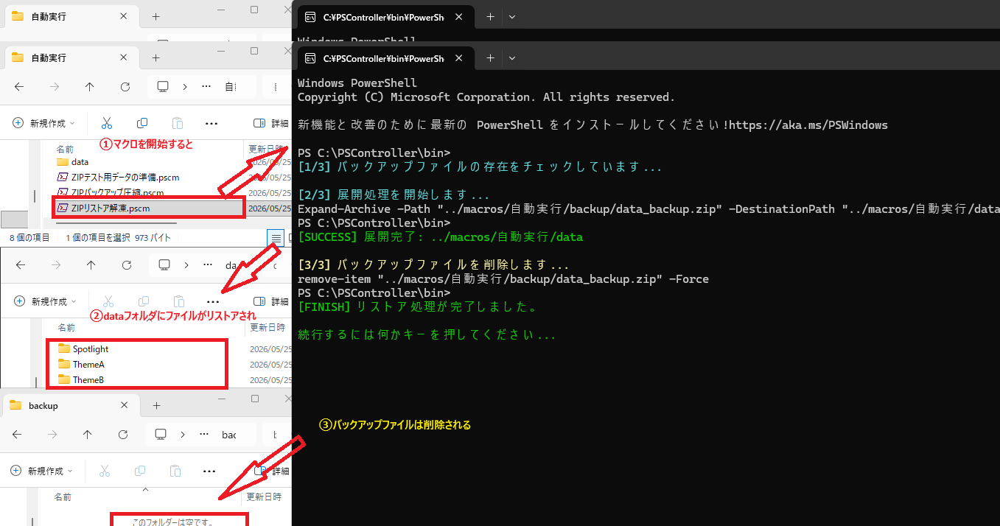
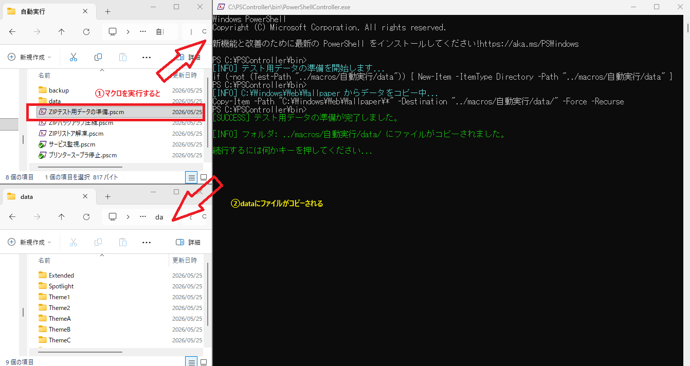

# サンプルマクロ紹介：自動化ツール・シリーズ

## その4：SSH自動ログインと環境ライフサイクル管理

### 📁 マクロファイル構成
ローカルPC上にOpenSSH環境を構築し、公開鍵認証を用いたセキュアなSSHログインから、テスト後のクリーンアップまでを自動化するマクロセットです。

* **環境構築：** `SSH環境セットアップ.pscm`
* **メイン処理：** `SSHログインテスト（公開鍵認証）.pscm`
* **環境削除（前半）：** `SSH環境削除.pscm`
* **ユーザー削除（後半）：** `SSHユーザー削除.pscm`

---

### 📝 概要
ローカル環境でのSSHテストを安全かつ迅速に行うための自動化フローです。公開鍵認証の設定からサービスの起動、不要になった際のユーザー・サービス削除までを一貫して管理します。本番環境へのデプロイ前の検証用として最適な構成です。

---

### 💻 マクロコード：SSH環境セットアップ (`SSH環境セットアップ.pscm`)
OpenSSHのインストール、サービス起動、テストユーザー作成、公開鍵認証用ペア作成を順次実行します。

```text
admin
echo on
wait >
print cyan OpenSSH インストール...
include .\include\ssh_openssh_install.pscm
wait >
print cyan OpenSSH サービススタート...
include .\include\ssh_openssh_Start-Service.pscm
wait >
print cyan ユーザー作成...
include .\include\ssh_user_create.pscm
wait >
print cyan 鍵ペア作成...
include .\include\ssh_keygen.pscm
wait >
print green [FINISH] セットアップ完了
pause
exit
```

---

### 💻 マクロコード：SSHログインテスト (`SSHログインテスト（公開鍵認証）.pscm`)
作成した鍵を使用して `psctest` ユーザーでログインし、`dir` コマンドを実行してログアウトする一連の操作を自動化します。

```text
echo on
wait >
print cyan [1/3] SSH Login...
ssh -i "$env:USERPROFILE\.ssh\psctest_key" psctest@localhost
waitto 10 psctest@WIN11-64
if lastwait == ng
    print red [ERROR] SSH Login failed.
    pause
    exit
endif
print cyan [2/3] Execute dir...
sendln dir
wait psctest@WIN11-64
print cyan [3/3] SSH Logout...
sendln exit
wait >
print green [FINISH] SSH Login, dir, Logout completed.
pause
exit
```

---

### 💻 マクロコード：環境削除 (`SSH環境削除.pscm`)
鍵ファイルの破棄とOpenSSHのアンインストールを行います。

```text
admin
echo on
wait >
print cyan Deleting SSH key files...
include .\include\ssh_keygen_delete.pscm
wait >
print cyan Uninstalling OpenSSH...
include .\include\ssh_openssh_uninstall.pscm
wait >
print green [FINISH] Cleanup completed.
print yellow [NOTE] Please reboot your PC.
print yellow [NOTE] After reboot, run SSHユーザー削除.pscm to delete psctest user.
pause
exit
```

---

### 💻 マクロコード：ユーザー削除 (`SSHユーザー削除.pscm`)
再起動後に実行し、テストユーザーを完全に削除します。

```text
admin
echo on
wait >
print cyan Deleting psctest user...
include .\include\ssh_user_delete.pscm
wait >
print green [FINISH] User deletion completed.
pause
exit
```

---

### 🛠️ 実行ステップと動作検証

1.  **【構築】SSH環境セットアップ**
    環境を自動構築します。
    

2.  **【テスト】SSHログインテスト**
    自動的に公開鍵認証が行われ、`dir` の結果が表示されます。
    

3.  **【削除】環境削除**
    `SSH環境削除.pscm を実行します。OpenSSHサービスの停止・アンインストールおよび関連ファイルの削除が行われます。
    
    
4.  **【削除】Windows再起動とユーザー削除**
    `PCを再起動した後、SSHユーザー削除.pscm を実行します。テスト用に作成したユーザーアカウントがシステムから完全に削除されます。
    

### 💡 技術的な注意事項
* **Include機能の活用:** 各マクロは機能単位で子マクロ化（`include`）されており、保守性と再利用性が高い構成になっています。
* **管理者権限:** `admin` コマンドを使用しているため、初回実行時にはUAC昇格が求められます。
* **再起動の必要性:** ユーザーアカウントを完全に削除するため、削除用マクロの前にはPCの再起動を推奨しています。
